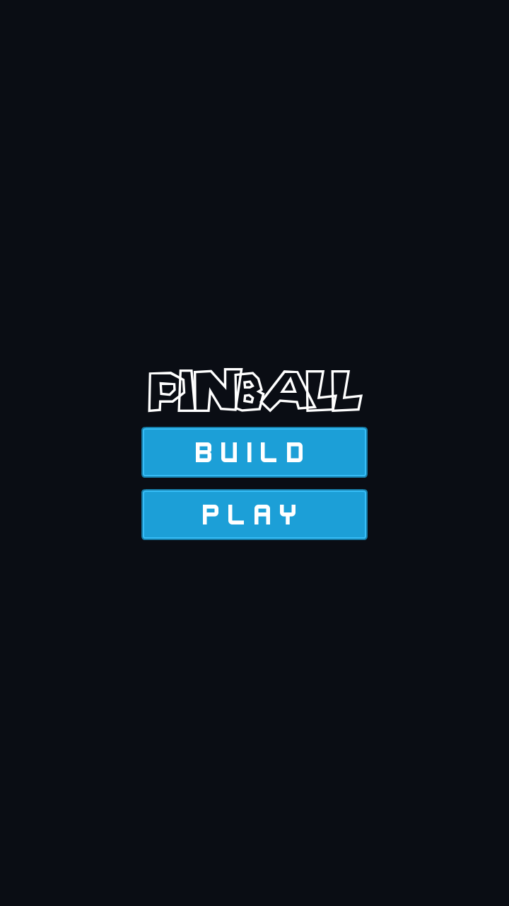
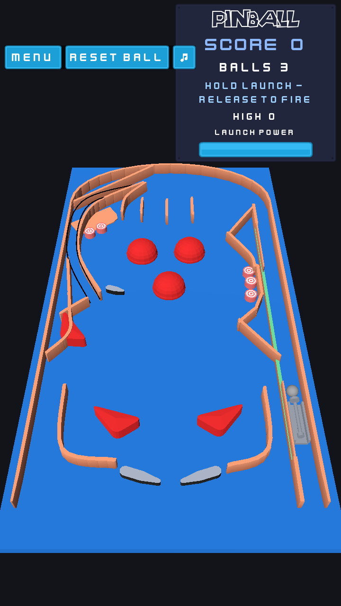
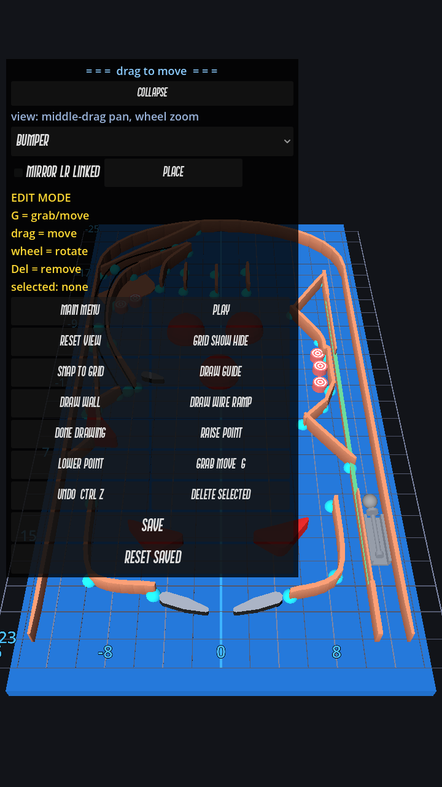

# Pinball (working title)

A physics-first 3D pinball game in Godot 4 (GDScript), targeting a commercial Steam release. The
current build is a playable prototype in a stylized low-poly look built on Kenney's CC0 asset packs
(models, textures, UI, fonts, audio) plus custom models authored in the same style, with an
in-browser table editor: you build the table yourself by placing parts on a grid, then switch to
Play.

## Screenshots

  
  
  

<em>Main menu &nbsp;&middot;&nbsp; gameplay with the backbox scoreboard &nbsp;&middot;&nbsp; the in-browser table editor</em>

## Play the demo

The newest playable build is deployed to the homelab demo URL on every push to `main` (ask the
project owner for the address). It boots to a main menu:

- **PLAY** - serve a ball and play.
- **BUILD** - open the in-game editor to shape the table.

### Controls (Play)

| Action            | Keyboard / Mouse        | Touch                                  |
|-------------------|-------------------------|----------------------------------------|
| Left flipper      | Left flipper key        | Tap/hold the **left half** of the screen  |
| Right flipper     | Right flipper key       | Tap/hold the **right half** of the screen |
| Launch / plunger  | **Space** (hold to charge, release to fire) | **Long-press** (hold > ~0.35s) |
| Pause / menu      | the **MENU** button     | tap **MENU**                           |

Pausing freezes the game and dims the table behind a translucent menu; **PLAY** resumes.

### Build mode (the in-game editor)

Build the table yourself - no coordinates to dictate, just drag:

- **Place** parts from the dropdown (bumpers, targets, slingshots, and imported parts like wire
  guides, rails, lane guides, drop/react targets). Imported parts are locked to game scale.
- **Move**: click-drag, or **G** to grab (Blender-style - it follows the cursor, click to drop,
  Esc/right-click to cancel). Mouse-wheel rotates the selected element.
- **Draw** smooth guide curves or straight walls point-by-point.
- **Mirror L/R**: places a linked twin across the centre so symmetric layouts build in one pass.
- **Camera**: middle-drag pans, the wheel zooms (1x-4x) and the grid gets finer as you zoom in.
- **SAVE** stores the layout in your browser and downloads `pinball_layout.json`; the table reloads
  it next time. Send that file to bake a layout in as the shipped default.

## Build and deploy model

The laptop is a thin client: code is edited in WSL, you `git push`. A self-hosted runner on the
homelab (label `godot`) does every build and test. The laptop never holds Godot or build tooling.

- **Push to `main`** -> `ci.yml` lints, and `deploy-demo.yml` builds the WEB export and publishes the
  demo. That URL is the newest playable prototype.
- **Tag `v*`** -> `release.yml` builds native Windows + Linux and publishes a GitHub Release. Steam
  is stubbed until a Steamworks App ID exists.
- Binary assets (`.glb` models, `.otf`/`.ttf` fonts, `.blend`) are stored with **Git LFS**.

## Tech notes

- Physics-first: the ball uses continuous collision detection at a 240 Hz tick so it cannot tunnel
  thin flippers/walls. Pop bumpers and slingshots kick on true contact, not proximity.
- World scale is anchored to the ball; imported real-scale part models convert at ~44 world units
  per metre (a real 1" wire guide lands about one ball wide).

## Repo map

- `scripts/` - the game (table, editor, flippers, ball, HUD, parts).
- `scenes/` - the Godot scenes; `assets/` - models and fonts.
- `CREDITS.md` - third-party asset attribution (some 3D parts are CC BY-SA 4.0).

## Credits

Third-party assets and their licenses are listed in `CREDITS.md`. The art, UI, fonts, and audio are
mostly from [Kenney](https://kenney.nl) asset packs (CC0), with the remaining scoring furniture
(mushroom pop bumper, slingshot wedges, bullseye targets) modelled from scratch for this project in
the same style. Some editor-placeable parts (wire guides, rails, lane guides, drop/react targets)
are derived from vbousquet/pinball-parts (CC BY-SA 4.0).
